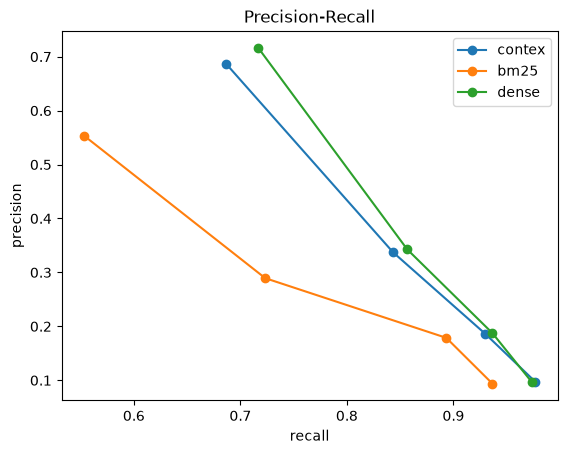

# Contex v1 (fixed) on HotpotQA: ties dense, beats BM25

**Date:** 2026-10-04
**Contex:** upstream `dd23889` (v1 + #241 fusion/HNSW fix + #238 title prefix), stock config
(gte-base via ONNX, hybrid on).
**Answer:** On HotpotQA, Contex **ties plain dense** at recall@5 (0.843 vs 0.857) and **beats BM25**
by +0.120. This matches SciFact. With Contex's current gte-base embedder, the hybrid's earlier
significant win over dense (+0.063 with MiniLM, v0.2.5) is gone on both benchmarks. Fusion depth
doesn't matter on HotpotQA (0.843 at every depth), so the #236 regression was specific to SciFact.

## Setup

Same 150 questions as every earlier HotpotQA run (SEED=13; qids verified identical to
`results_n150.jsonl`), pooled into a 1,493-paragraph corpus. k=5. `dense` is gte-base, the same
model Contex embeds with. Paired bootstrap, 10k resamples.

## Retrieval (`run_beir.py 5 hotpot-v1fix`)

| method | recall@5 | context tokens |
|---|---|---|
| dense (gte-base) | **0.857** | 654 |
| contex (fixed v1) | 0.843 | 685 |
| bm25 | 0.723 | 652 |

- contex − dense = **−0.013, [−0.040, +0.013]**, a tie (W/T/L 6/134/10)
- contex − bm25 = **+0.120, [+0.077, +0.163]**, excludes 0 (W/T/L 36/110/4)

**Fusion replay** (`fusion_replay.py hotpot-v1fix 5`):

| | recall@5 |
|---|---|
| Contex vector-only | 0.830 |
| ParadeDB BM25 only | 0.730 |
| RRF at depth 5 / 10 / 20 / 30 / 50 / 100 | 0.843 / 0.843 / 0.850 / 0.843 / 0.843 / 0.843 |

Fusion adds +0.013 over Contex's own vector ranking (CI [−0.010, +0.037]), and depth has no effect.
As on SciFact, Contex's vector side sits below plain dense (0.830 vs 0.857) because of the text it
embeds: the `root | para_id: … | title: … | text: …` node format, now with a title prefix as well.

## Across Contex versions (HotpotQA recall@5, same 150 questions)

| Contex | embedder | contex | dense | contex − dense |
|---|---|---|---|---|
| original (broken FTS) | MiniLM | 0.770 | 0.767 | tie |
| v0.2.5 (ParadeDB BM25) | MiniLM | 0.830 | 0.767 | +0.063 (sig) |
| **v1 + #241** | **gte-base** | **0.843** | **0.857** | **−0.013 (tie)** |

Contex's absolute recall is the best it has been (0.843). The upgraded embedder lifted the dense
baseline (0.767 → 0.857) further than it lifted the hybrid. This is the result the embedder
ablation predicted (`2026-09-14-embedder-ablation.md`).

## Answer quality (agent in the loop)

Qwen2.5-7B-Instruct-4bit, temperature 0, same prompt as September. Each method's top-5 context is fed
to the agent. Official HotpotQA EM/F1.

| method | recall@5 | EM | answer-F1 | ctx tokens | gen tokens | feasible |
|---|---|---|---|---|---|---|
| contex (fixed v1) | 0.843 | 0.447 | **0.583** | 686 | 4.3 | 150/150 |
| dense | **0.857** | **0.453** | 0.571 | 654 | 4.2 | 150/150 |
| bm25 | 0.723 | 0.340 | 0.457 | 652 | 3.9 | 150/150 |
| dump-all | 1.000 | — | — | **215,295** | — | **0/150** |

Paired bootstrap (`scripts/analyze.py`):

| metric | vs | mean | 95% CI | W/T/L |
|---|---|---|---|---|
| EM | dense | −0.007 | [−0.060, +0.047] | 8/133/9 |
| answer-F1 | dense | +0.011 | [−0.042, +0.063] | 17/121/12 |
| EM | bm25 | **+0.107** | [+0.047, +0.167] | 20/126/4 |
| answer-F1 | bm25 | **+0.126** | [+0.068, +0.184] | 27/118/5 |

- **Contex ties dense on answer quality** and significantly beats BM25 on both EM and F1.
- **Compared with the September agent run (original Contex, broken FTS, MiniLM):** Contex EM went from 0.400 to 0.447 and F1 from
  0.508 to 0.583. Better retrieval carries straight through to better answers.
- **The agent didn't change.** BM25's EM (0.340) and F1 (0.457) are identical to the September
  server-based run. BM25 retrieval is unchanged, so the in-process agent reproduces the old one
  exactly.
- **Lean beats dumping:** dump-all needs about 215k tokens per question and fits the 28k budget for
  none of them. Every ranked method answers all 150 at about 650–690 tokens, roughly 300× less.

**Precision-recall sweep** (k = 2, 5, 10, 20; `pr_curve_n150_v1fix.png`): Contex tracks dense closely
at every k, and both sit well above BM25 across the whole curve.



Per-question records: `results_n150_v1fix.jsonl`.

## Caveats

- The agent ran in-process (`CONTEXEVAL_AGENT=mlx`, same model and prompt, greedy decoding), because
  `mlx_lm.server` 0.31.3 bound its port and never answered. Generation token counts exclude the EOS
  token, so they can read about one lower than the September server-based numbers.
- Single run. Confidence comes from the paired bootstrap over 150 questions.

## Reproducing

```
python -c "from contexeval import prep; prep.main(150)"
CONTEX_MCP_URL=http://127.0.0.1:8011/mcp python scripts/run_beir.py 5 hotpot-v1fix
python scripts/fusion_replay.py hotpot-v1fix 5
CONTEX_MCP_URL=http://127.0.0.1:8011/mcp CONTEXEVAL_AGENT=mlx CONTEXEVAL_DEVICE=mps \
  python scripts/run.py 150 pilot && python scripts/analyze.py
```
